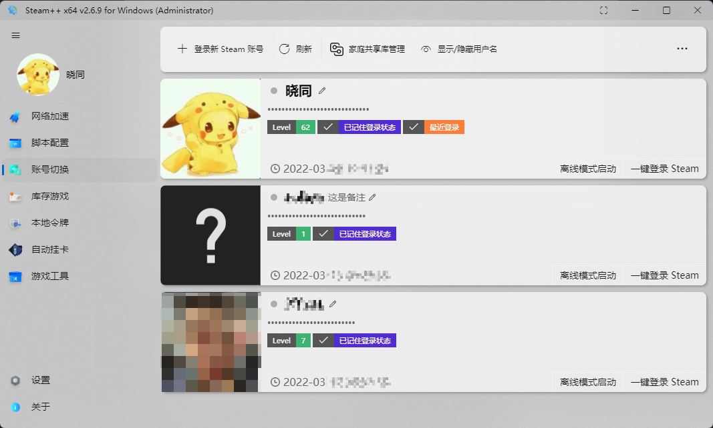
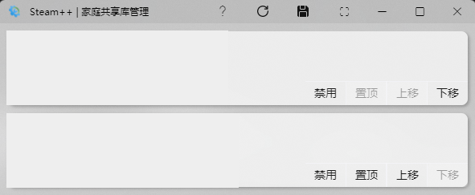
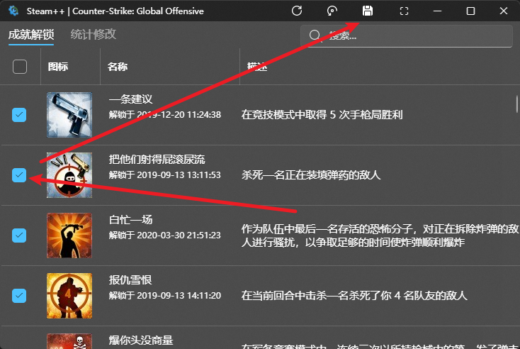

# Steam++ 指南

[仓库地址 `https://github.com/XTsat/SteamTools-Guide`](https://github.com/XTsat/SteamTools-Guide)

[网页地址 `https://xtsat.github.io/SteamTools-Guide`](https://xtsat.github.io/SteamTools-Guide)

**注意**：此教程具有一定的时效性，截止最后一次更新时间为`2022年3月29日`，steam++ 版本为 `Steam++ x64 v2.6.9 for windows`

## 什么是 Steam++？

🛠「Steam++」是一个开源跨平台的多功能Steam工具箱。

[Steam++ 官网](https://steampp.net/)

[GitHub 开源仓库](https://github.com/SteamTools-Team/SteamTools)

[\[原创发布\]Steam++ 工具箱](https://keylol.com/t667906-1-1) [(其乐 Keylol)@软妹币玩家](https://keylol.com/suid-269966)

## 怎么下载 Steam++

- [GitHub Releases](https://github.com/BeyondDimension/SteamTools/releases)
- [Gitee Releases](https://gitee.com/rmbgame/SteamTools/releases)
- [Official WebSite](https://steampp.net)
- [Arch Linux Package](https://aur.archlinux.org/packages/steam%2B%2B-bin)(By [zhanghua000](https://github.com/zhanghua000))

## Steam++ 有什么功能

### 网络加速 (Support Windows / Linux / macOS / Android)

- 实现对 `Steam` `Discord` `Twitch` `Origin` `Uplay` `GitHub` `Microsoft Store` `谷歌验证码` `Pixiv` 等国内难以访问的网页正常访问，防止网络被干扰

- 功能类似 [Steamcommunity 302](https://www.dogfight360.com/blog/686/) ，使用 [Titanium-Web-Proxy](https://github.com/justcoding121/Titanium-Web-Proxy) 开源项目进行本地反代。

- 有`Host代理模式`和`系统代理模式`两种方式可以选择，第一次使用前需要确认安装证书文件

- 还能解除 **Steam 商店**的**访问限制**，包括但不限于：`您所在的地区目前不提供此物品` `此游戏标记为“仅限成人”。您看到此游戏是因为您   已将偏好设置为允许此类内容。`

<b>[点击展开]-常见问题</b>

> Q: hosts 正在由另一进程使用，因此该进程无法访问此文件？
>
> A: hosts 文件被其它程序占用了导致本程序无法正常读写，使用 `资源监视器` 在 `关联的句柄` 中搜索 hosts 找到占用的进程，结束掉该进  程即可。
>
> Q: 社区加速里的脚本启用了无效，为什么脚本前面的勾选框不会被保存？
>
> A: 脚本需要对应的加速服务开启才能生效，同时也必须启用了加速功能后启用脚本才有效，例如 `Steam 商店史低查询` 脚本必须要启用   `Steam 商店加速服务` 才能生效。
>
> Q: 使用加速提示证书安装失败？
>
> A: 一般是系统相关文件丢失导致，可以尝试手动安装程序目录 `AppData` 文件夹下的 `SteamTools.Certificate.pfx` 证书文件，安装到受  信任  的根证书区域，区域一定要选择正确，不然安装成功也无效，密码留空不填直接确定即可。

### 脚本配置 (Windows / Linux / macOS Only)

- 通过加速服务拦截网络请求将一些 JS 脚本注入在网页中(Steam内置浏览器)，提供类似网页插件的功能。使 Steam 内置的浏览器可以使用部分脚本

- 比如 `Steam历史最低价格查询` `Steam Economy Enhancer(Steam 市场增强)` `CSGO Market Tool(CSGO市场查询枪支磨损值)`

### 账号切换 (Windows / Linux / macOS Only)

- 通过 Steam **默认保存**的**凭证信息**一键切换已在当前 PC 上登录过的 Steam 账号，并且可以一键离线登录，还能管理家庭共享库排序等功能。

<picture>
<source srcset="./Photo/Home/Account-switching-dark.png" media="(prefers-color-scheme: dark)">

</picture>

<b>[点击展开]-常见问题</b>

> Q: 账号切换之后还是需要输入密码和令牌？为什么有时候可以一键切换有时候不行？
>
> A: Steam++ 的账号切换功能并没有记录你的密码和令牌， 能实现快速切换账号是因为 Steam 本身的记住密码功能，如果你没有记住密码登陆过账号，或者你的记住登陆状态丢失，都会导致账号切换之后需要密码和令牌，解决方法是下线所有当前 Steam 登陆的设备，重新在你的 PC 记住密码登陆一次。

[家庭库共享](https://help.steampowered.com/zh-cn/faqs/view/57A7-503C-991F-E9A8)(Steam 客服)

调整当前设备上共享的 Steam 账号优先级顺序，用于解决想玩账号B的共享却一直使用的是账号A的共享这种问题，从上到下的排序为共享库使用的优先级顺序，也可以选择暂时禁用或启用指定账号的共享。调整后保存重启 Steam 生效！

<picture>
<source srcset="./Photo/Home/Family-Library-Sharing-dark.png" media="(prefers-color-scheme: dark)">

</picture>

### 库存管理 (Windows / Linux / macOS Only)

- 让您直接管理到 Steam 游戏库存，不仅能够下载老版本的 Steam 游戏，也能够对 Steam 游戏成就进行直接管理，支持解锁成就以及反解锁成就。

- 可以使用 Steam 下载完成定时关机使无人下载完成后能减少不必要的耗电(比如晚上睡觉自动下载完成后自动关机)

<picture>
<source srcset="./Photo/Home/Auto-shutdown-dark.png" media="(prefers-color-scheme: dark)">

</picture>

- 还可以自定义启动 Steam++ 后挂游戏时长的功能

<picture>
<source srcset="./Photo/Home/Auto-Gametime-dark.png" media="(prefers-color-scheme: dark)">

</picture>

<b>[点击展开]-Steam 游戏成就解锁：</b>

Steam 游戏成就解锁使用开源项目 [SteamAchievementManager](https://github.com/gibbed/SteamAchievementManager)

>该功能带有一定(低)风险，理论上不会被 VAC，但如果滥用可能被游戏厂商拉黑，建议在不启动游戏的情况下使用，截至目前为止还未有影响。解锁成就功能并不是外挂程序，原理上仅与 Steam 进行通信，和游戏本身并无关系，像 VAC 之类的反作弊系统是在多人游戏中发挥作用。如果游戏与其他平台绑定，解锁成就不会同步到其他平台上，如果重新完成成就，其他平台上也可能不会更新，例如 Sea of Thieves 与 Xbox 绑定。

<picture>
<source srcset="./Photo/Home/Sam-dark.png" media="(prefers-color-scheme: dark)">

</picture>

通过勾选成就并保存成就更改(**注意**：最好不要对有 `VAC` 的游戏进行成就更改，以免造成不必要的损失，下图就是一个有 `VAC` 的游戏)

<picture>
<source srcset="./Photo/Home/Sam2-dark.png" media="(prefers-color-scheme: dark)">

</picture>

### 本地令牌 (Support Windows / Linux / macOS / Android)

- 让您的手机令牌统一保存在电脑中，目前仅支持 Steam 令牌，后续会开发支持更多的令牌种类与云同步令牌。

- 类似于 `WinAuth` (可以通过导出的方式将 `WinAuth 2步验证` 导入 `Steam++`，使用[开源项目Winauth](https://github.com/winauth/winauth))

  [如何导入steam令牌](Docs/How-To-Import-Steam-Token.md)
  
  [steam++令牌导入教程](https://keylol.com/t710508-1-1) [(其乐 Keylol)@cyb233](https://keylol.com/suid-988278)
  
  [steam++令牌导入教程](https://www.bilibili.com/read/cv10145839) [(BiliBili)@牛奶君](https://space.bilibili.com/484296)

### 自动挂卡 (Support Windows / Linux / macOS / Android)

- 集成开源项目 [ArchiSteamFarm](https://github.com/JustArchiNET/ArchiSteamFarm) 在应用内提供挂机掉落 `Steam 集换式卡牌` 等功能。

- [最简单的ASF食用手册](https://keylol.com/t770760-1-1) [(其乐 Keylol)@cyb233](https://keylol.com/suid-988278)

### 游戏工具 (Windows Only)

- 可以强制游戏窗口使用无边框窗口化或是全屏，也可以将游戏画面置于桌面壁纸上(与动态壁纸软件冲突)

<picture>
<source srcset="./Photo/Home/Game-Setting-dark.png" media="(prefers-color-scheme: dark)">

</picture>

## [如何导入steam令牌](Docs/How-To-Import-Steam-Token.md)

- [如何导入steam令牌](Docs/How-To-Import-Steam-Token.md)

- [steam++令牌导入教程](https://keylol.com/t710508-1-1) [(其乐 Keylol)@cyb233](https://keylol.com/suid-988278)

- [steam++令牌导入教程](https://www.bilibili.com/read/cv10145839) [(BiliBili)@牛奶君](https://space.bilibili.com/484296)

## 常见问题解决办法

遇到问题可以先尝试更新到最新版本，可能新版本已经修复了问题

点 `关于` `检查更新` 即可

<picture>
<source srcset="./Photo/Home/Setting-Update-dark.png" media="(prefers-color-scheme: dark)">

</picture>

### 网络问题

#### host 文件相关(只读，拒绝访问，没有权限)

- 请前往 `C:\Windows\System32\drivers\etc` ，右击`host`文件，打开 `属性` ，取消下面的 `只读` 选项。

- 只读也可能是被其他软件占用，或者因杀毒软件拦截导致的，如果 `hosts` 文件没有自定义的内容，可以先删除该文件后再启动，或者使用 系统代理模式，文件位于 `C:\Windows\System32\drivers\etc\hosts`

- 或者通过断网一键修复程序自动重置 host 问题，如 `360断网急救箱` `火绒断网修复`

#### 程序崩溃后无法连接网络

- 程序加速过程中崩溃后，社区/游戏服务器无法连接是因为崩溃后写入 `host` 的 `127.0.0.1` 未被正常消除，可以取消加速后重新打开，也可以手动清理掉 `host` 文件

- 或者通过断网一键修复程序自动重置 `host` 问题，如 `360断网急救箱` `火绒断网修复`

>崩溃后无网络的问题，是因为加速和停止加速本来有正常的逻辑要执行，因为在加速中将程序强退了，所以停止加速的逻辑没执行，也就没还原加速所修改的配置导致的。
>
>遇到这个问题可以尝试还原hosts文件，关闭windows系统代理，重置网络服务

---

[回到目录](#steam-指南)
