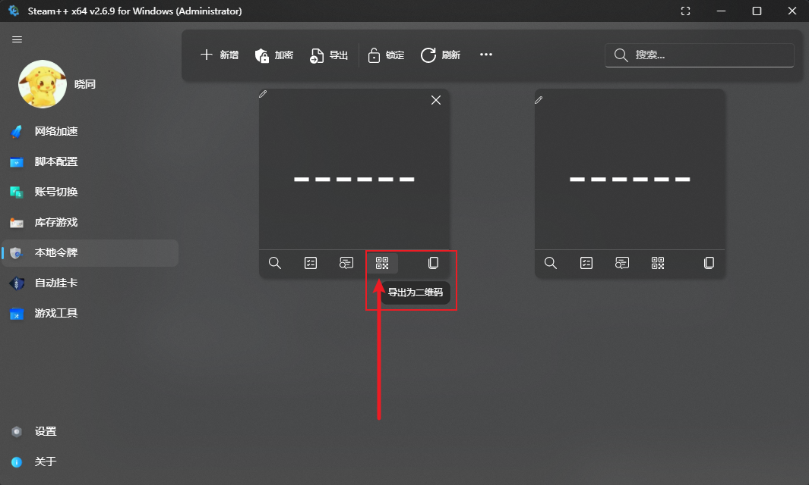

# 如何导入 Steam 令牌

**注意**：此教程具有一定的时效性，如果不符合教程请确认最后更新时间和 steam++ 版本是否是最新版

## PC 端 Steam++

### 通过 旧版/新版Steam++ 导入

- 由Steam++V1版本导出的 .dat 文件，通常默认命名为“Steam++ Authenticator 日期.dat”

- 由Steam++V2版本导出的 .mpo 文件，通常默认命名为“Steam++  Authenticators 日期.mpo”

Steam++ 点击`令牌管理`-`新增`选择`Steam++ 导入`

### 通过 有效的2FA(二步验证)应用 导入

#### WinAuth

导出的.txt文件，通常默认命名为“winauth-日期.txt”

[steam++令牌导入教程-从WinAuth导入](https://www.bilibili.com/read/cv10145591)  [(BiliBili)@牛奶君](https://space.bilibili.com/484296)

#### Steam Desktop Auth(SDA)

导出的.maFile文件，通常默认命名为“一串数字.maFile”

- SDA会自动在应用目录下的maFile文件夹生成账号的.maFile文件

Steam++ 点击`令牌管理`-`新增`-选择`Steam++ 导入`

[steam++令牌导入教程-从Steam Desktop Authenticator导入](https://www.bilibili.com/read/cv10145788) [(BiliBili)@牛奶君](https://space.bilibili.com/484296)

#### 其他2FA应用

根据软件说明，复制/导出令牌，并找到以下所需内容并依照图片输入

### 通过 安卓手机Steam 导入

安卓手机根据不同情况不同厂商可分为三种情况：
任意安卓手机，有root
部分安卓手机厂商，有自家备份软件，且备份文件无加密/加密可破解
手机无root，且无法备份对应数据/无法解密备份数据的，此方法由于是重新绑定，所以可能有暂挂

#### 有root

[steam++令牌导入教程-从Android App导入-须root的方式](https://www.bilibili.com/read/cv10142098?from=articleDetail) [(BiliBili)@牛奶君](https://space.bilibili.com/484296)

- 一台绑定了目标账号令牌，并且已经被root的手机

#### 无root

>需要一台绑定了目标账号令牌的手机，根据手机品牌不同，还需要不同的软件，这一方案并非全品牌适用

[steam++令牌导入教程-从Android App导入-无须root的方式](https://www.bilibili.com/read/cv10052462) [(BiliBili)@牛奶君](https://space.bilibili.com/484296)

本方案涉及手机品牌较多，总结概述为：

1. 通过具备高权限的手机厂商自家备份软件对 SteamApp 进行备份

2. 提取备份文件导入令牌

已知的相关教程链接：

>[~~vivo~~](https://keylol.com/t684133-1-1)新版已加密
>
>[小米](https://keylol.com/t524510-1-1)
>
>[LG](https://keylol.com/t582900-1-1)解密
>
>[~~华为~~](https://keylol.com/t666792-1-1)新版已修改加密

更多品牌手机可参考以上教程自行研究

#### 无root，可能有暂挂

[安卓手机利用 ADB 免 root 导出令牌（避免暂挂）](https://keylol.com/t757408-1-1) [(其乐 Keylol)@sffxzzp](https://keylol.com/suid-218128)

### 通过 苹果手机Steam 导入

#### 已越狱

此方案引用并修改自[Steam++ issues #95](https://github.com/SteamTools-Team/SteamTools/issues/95)

用 **Filza** 打开`/var/mobile/Containers/Data/Application/{字符串}`，数字串位置为Steam 数据文件夹，可能不一样，Filza会显示为“Steam”
用文本方式打开`/Documents/Steamguard-xxxxxxxxxxxxxxxx`，到最下面找到 otpauth 那一栏粘贴到 Steam++
用文本方式打开`/Library/Preferences/com.valvesoftware.Steam`，并找到`<string>/var/mobile/Containers/Data/Application/XXXXXXXX-XXXX-XXXX-XXXX-XXXXXXXXXXXX/Library/Caches</string>`，复制`XXXXXXXX-XXXX-XXXX-XXXX-XXXXXXXXXXXX`并在最前面添加`android:`并粘贴到 Steam++

#### 未越狱，可能有暂挂

iOS的令牌导出可参考：

>[越狱IOS设备无损导入Steam令牌至Steam++](https://keylol.com/t728973-1-1)
>
>[高版本的iOS导出Steam手机令牌教程](https://keylol.com/t696543-1-1)
>
>[2021未越狱iOS设备提取Steam令牌导入ASF的方法](https://keylol.com/t703874-1-1)
>
>[\[云挂卡\]未越狱iOS设备也可以使用ASF 2FA功能了](https://keylol.com/t245711-1-1)

简单步骤：

1. 解绑Steam令牌
2. 卸载并安装`iTunes旧版`
3. 使用 `iOS旧版应用下载` 下载`旧版本Steam`
4. `提取ipa`并使用`爱思助手等工具`安装
5. 绑定令牌并备份数据

### 通过 登录Steam账号 导入

此方案最为简单，如下图直接通过Steam账号登录即可，但请**注意**：`本方案将解除手机端令牌并导致15天的市场交易暂挂`

- 你的 Steam 账号和密码，此操作会解除原有令牌，导致账号进入暂挂状态（15天内无法市场交易）

## Android 端 Steam++

### 通过 新版Steam++ 导入

> PC 端 `Steam++ v2.4.9` 或更高版本

1. 通过 扫码 导入

    在PC端点击如图所示`导出为二维码`按钮，在手机端点击 `右上角加号`-->`新增` 进行扫码

    

2. 通过 文件 导入

    在PC端点击如图所示`导出`按钮并`确认导出`，将导出的文件发送至手机，在手机端点击 `右上角加号`-->`新增` 进行导入

    

### 通过 手机Steam 导入

请参阅 [通过 有效的2FA(二步验证)应用 导入](#通过-有效的2fa-二步验证-应用-导入) / [通过 安卓手机Steam 导入](#通过-安卓手机steam-导入) / [通过 苹果手机Steam 导入](#通过-苹果手机steam-导入) 章节

## 参考文档

- [steam++令牌导入教程](https://keylol.com/t710508-1-1) [(其乐 Keylol)@cyb233](https://keylol.com/suid-988278)`本帖当前对应 Steam ++ 版本为：2.4.11`已授权转载及修改，本文基于原文优化

- [steam++令牌导入教程](https://www.bilibili.com/read/cv10145839) [(BiliBili)@牛奶君](https://space.bilibili.com/484296)
