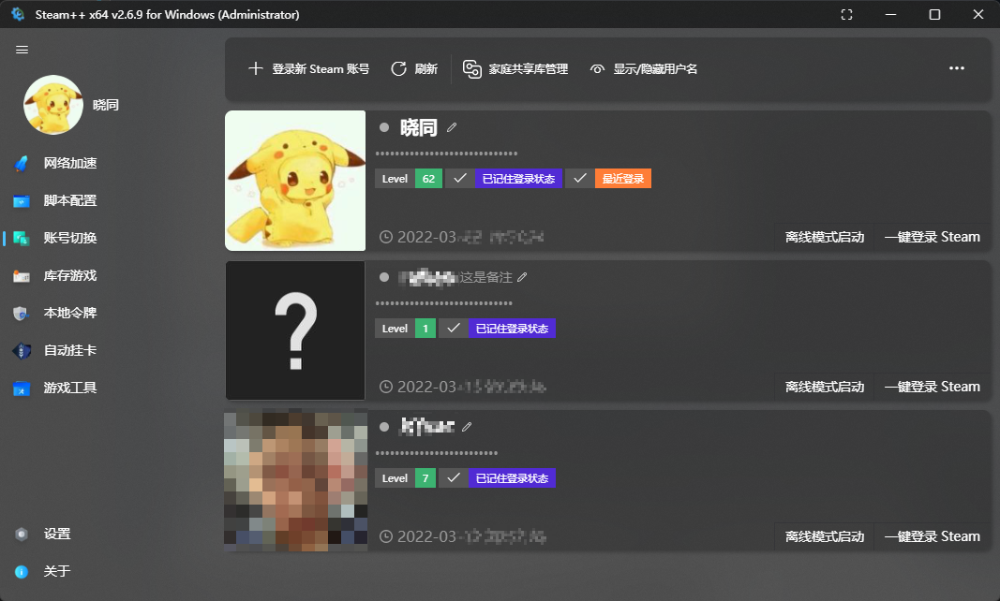

# 账号切换

- 通过 Steam **默认保存**的**凭证信息**一键切换已在当前 PC 上登录过的 Steam 账号，并且可以一键离线登录，还能管理家庭共享库排序等功能。

  

::: details [点击展开]-常见问题

> Q: 账号切换之后还是需要输入密码和令牌？为什么有时候可以一键切换有时候不行？
>
> A: Watt Toolkit 的账号切换功能并没有记录你的密码和令牌， 能实现快速切换账号是因为 Steam 本身的记住密码功能，如果你没有记住密码登陆过账号，或者你的记住登陆状态丢失，都会导致账号切换之后需要密码和令牌，解决方法是下线所有当前 Steam 登陆的设备，重新在你的 PC 记住密码登陆一次。

:::
