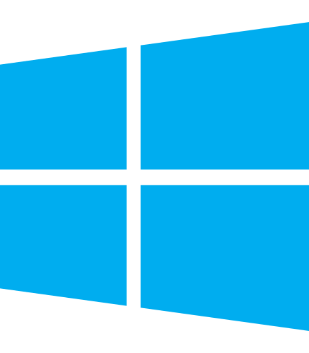

# 网络加速    

- 实现对 `Steam` `Discord` `Twitch` `Origin` `Uplay` `GitHub` `Microsoft Store` `谷歌验证码` `Pixiv` 等国内难以访问的网页正常访问，防止网络被干扰

- 功能类似 [Steamcommunity 302](https://www.dogfight360.com/blog/686/)，使用 [Titanium-Web-Proxy](https://github.com/justcoding121/Titanium-Web-Proxy) 和 [YARP.ReverseProxy](https://github.com/microsoft/reverse-proxy) 开源项目进行本地反代来支持更快的访问游戏网站。

- 有`Host代理模式`和`系统代理模式`两种方式可以选择，第一次使用前需要确认安装证书文件

- 还能解除 **Steam 商店**的**访问限制**，包括但不限于：`您所在的地区目前不提供此物品` `此游戏标记为“仅限成人”。您看到此游戏是因为您   已将偏好设置为允许此类内容。`

::: details [点击展开]-常见问题

> Q: hosts 正在由另一进程使用，因此该进程无法访问此文件？
>
> A: hosts 文件被其它程序占用了导致本程序无法正常读写，使用 `资源监视器` 在 `关联的句柄` 中搜索 hosts 找到占用的进程，结束掉该进  程即可。
>
> Q: 社区加速里的脚本启用了无效，为什么脚本前面的勾选框不会被保存？
>
> A: 脚本需要对应的加速服务开启才能生效，同时也必须启用了加速功能后启用脚本才有效，例如 `Steam 商店史低查询` 脚本必须要启用   `Steam 商店加速服务` 才能生效。
>
> Q: 使用加速提示证书安装失败？
>
> A: 一般是系统相关文件丢失导致，可以尝试手动安装程序目录 `AppData` 文件夹下的 `SteamTools.Certificate.pfx` 证书文件，安装到受  信任  的根证书区域，区域一定要选择正确，不然安装成功也无效，密码留空不填直接确定即可。

:::

## 加速方式

- Dns 驱动拦截模式
  - 未实装
- Hosts 代理模式
  - 效果不错，但有些人会遇到问题不便使用
- PAC 代理模式
  - 未实装
- 系统代理模式
  - 有时加速效果不佳，但基本都能使用

## 加速类目

简略展示常用的可加速站点

- Steam 服务
  - 常规社区加速
  - 商店解锁访问限制
  - 讨论组/聊天(仅ipv6)
- Discord 语音聊天
- Twitch 直播
- Origin
- Uplay
- 公共 CDN
- 国外验证码平台
  - Arkoselabs
  - hCaptcha
  - Recaptcha(Goole)
- Github
- Microsoft Store
- 网盘服务
  - OneDrive
  - MEGA
  - DropBox
- 其他网站
  - Pinterest
  - Artstation
  - V2ex
  - Imgur 图床
  - Pixiv

## 修复

点击网络加速右上角的更多 `···`

`移除证书` 并 `重置 Hosts 文件`

- 参考：

  - [常见问题 > 网络加速问题](../../FAQ/网络.md)
