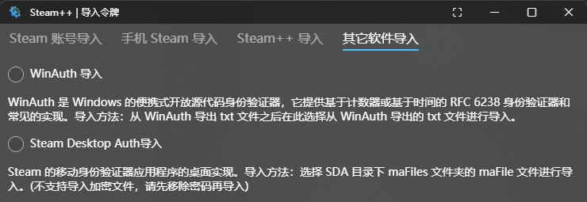
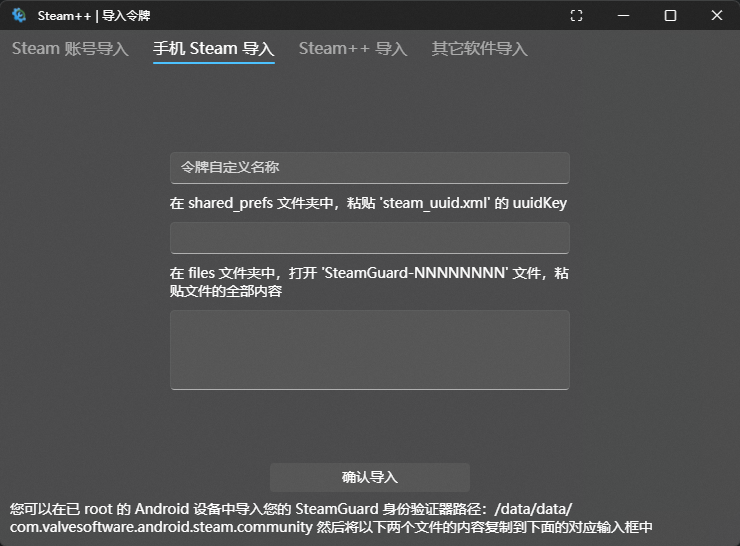

# 2FA应用导入令牌

## WinAuth

导出的.txt文件，通常默认命名为“winauth-日期.txt”

[steam++令牌导入教程-从WinAuth导入](https://www.bilibili.com/read/cv10145591)  [(BiliBili)@牛奶君](https://space.bilibili.com/484296)

## Steam Desktop Auth(SDA)

导出的.maFile文件，通常默认命名为“一串数字.maFile”

- SDA会自动在应用目录下的maFile文件夹生成账号的.maFile文件

Steam++ 点击`令牌管理`-`新增`-选择`Steam++ 导入`

[steam++令牌导入教程-从Steam Desktop Authenticator导入](https://www.bilibili.com/read/cv10145788) [(BiliBili)@牛奶君](https://space.bilibili.com/484296)

## 其他2FA应用

根据软件说明，复制/导出令牌，并找到以下所需内容并依照图片输入

