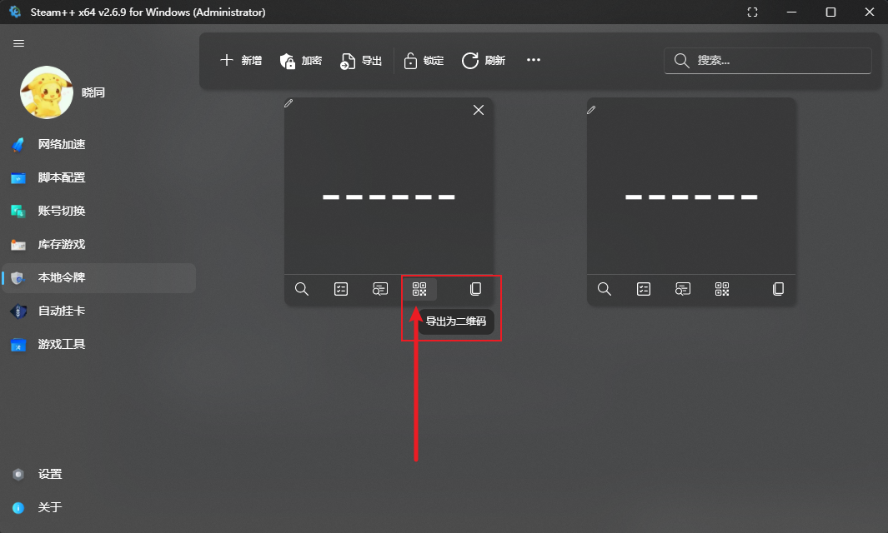

# Older/newer Steam++ import

- .dat files exported from Steam++V1, usually named "Steam++ Authenticator date.dat" by default

- .mpo files exported from Steam++V2, usually named "Steam++ Authenticators date.mpo" by default

Steam++ Click `Steam Authenticator`-`New`- choose and select `Import from Steam++`.

## Mobile Steam++ import

> PC side `Steam++ v2.4.9` or higher

1. Import by code scanning

    Click the `Export as QR Code` button on the PC side as shown in the picture, and click the `Top Right Plus` -> `Add` on the mobile side to scan the code

    

2. Import via file

    Click the `Export` button and `Confirm Export` on the PC side, send the exported file to your cell phone, and click the `Top right plus sign` --> `Add` on the cell phone side to import

    
