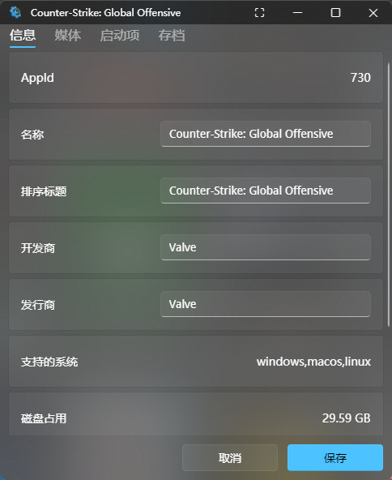
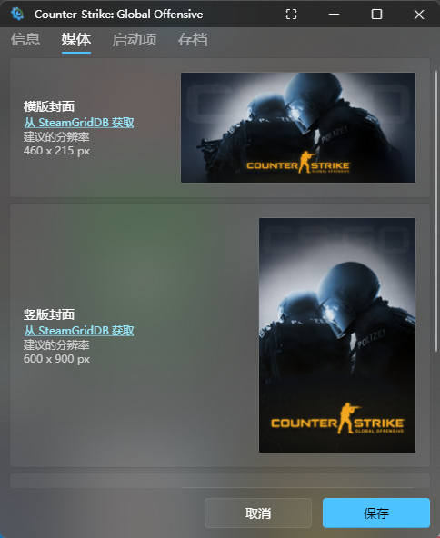
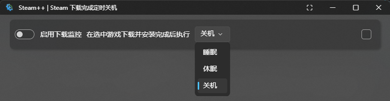
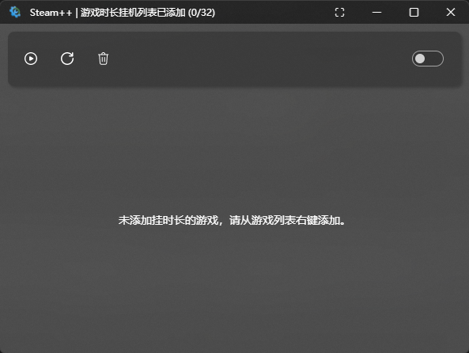
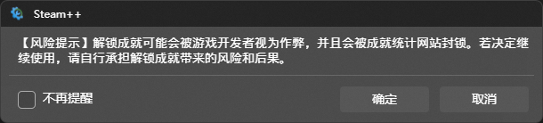
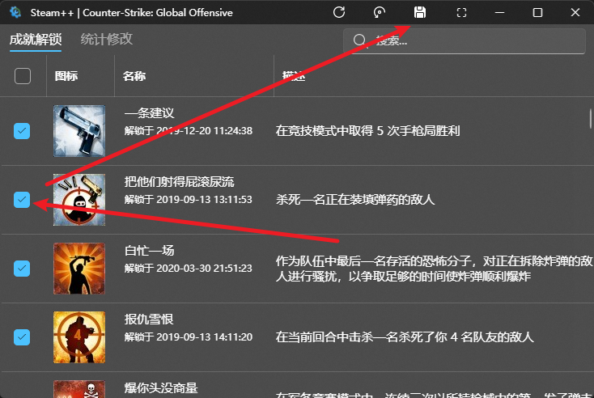

# 库存管理

- 让您直接管理到 Steam 游戏库存，~~不仅能够下载老版本的 Steam 游戏，~~ 也能够对 Steam 游戏成就进行直接管理，支持解锁成就以及反解锁成就。

## 其他功能

### 游戏信息修改

- 一键修改游戏的信息和图片等数据

  ::: details 图例

  
  
  
  :::

- 右键游戏 > 点击 编辑游戏信息

目前有bug导致恢复原始数据不方便

### 下载完自动关机

- 可以使用 Steam 下载完成定时关机使无人下载完成后能减少不必要的耗电(比如晚上睡觉自动下载完成后自动关机)

  

### 挂时长

- 让指定的游戏(最多32个)通过虚拟启动增加游戏时间，不用下载也能加长游戏时间

  

### 成就解锁

:::: details [点击展开]-Steam 游戏成就解锁：

Steam 游戏成就解锁使用开源项目 [SteamAchievementManager](https://github.com/gibbed/SteamAchievementManager)

::: warning

该功能带有一定风险，理论上不会被 VAC，但如果滥用可能被游戏厂商拉黑，建议在不启动游戏的情况下使用，截至目前为止还未有影响。解锁成就功能并不是外挂程序，原理上仅与 Steam 进行通信，和游戏本身并无关系，像 VAC 之类的反作弊系统是在多人游戏中发挥作用。如果游戏与其他平台绑定，解锁成就不会同步到其他平台上，如果重新完成成就，其他平台上也可能不会更新，例如 Sea of Thieves 与 Xbox 绑定。

:::

通过勾选成就并保存成就更改(**注意**：最好不要对有 `VAC` 的游戏进行成就更改，以免造成不必要的损失，下图就是一个有 `VAC` 的游戏)

::::
