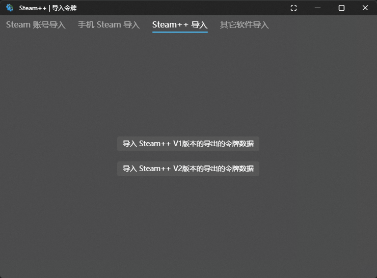
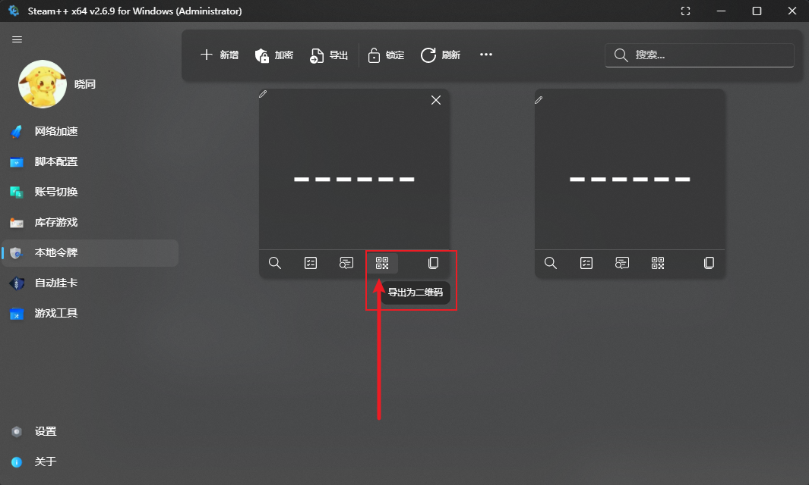
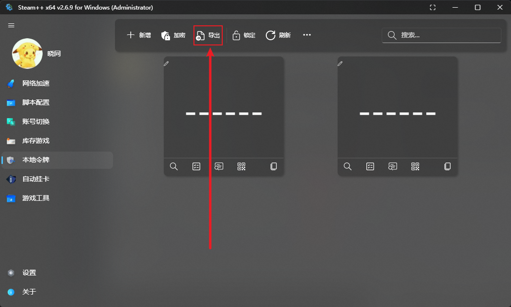

# Steam++

- 由Steam++V1版本导出的 .dat 文件，通常默认命名为“Steam++ Authenticator 日期.dat”

- 由Steam++V2版本导出的 .mpo 文件，通常默认命名为“Steam++  Authenticators 日期.mpo”

Watt Toolkit 点击`令牌管理`-`新增`选择`Steam++ 导入`

## 手机Steam++导入

> PC 端 `Steam++ v2.4.9` 或更高版本

1. 通过 扫码 导入

    在PC端点击如图所示`导出为二维码`按钮，在手机端点击 `右上角加号`-->`新增` 进行扫码

    

2. 通过 文件 导入

    在PC端点击如图所示`导出`按钮并`确认导出`，将导出的文件发送至手机，在手机端点击 `右上角加号`-->`新增` 进行导入

    
